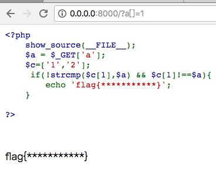
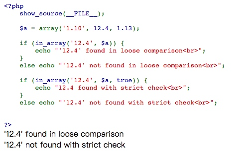

# PHP代码安全
PHP相关题目一般是CTF竞赛中Web类题目考察最多的，PHP语言具有很多特性，这些特性通常会造成预料之外的安全问题，也是很多CTF竞赛考查的知识点。
### 一、浮点数精度问题
### 理论知识
在用PHP进行浮点数的运算中,经常会出现一些和预期结果不一样的值，这是由于浮点数的精度有限。尽管取决于系统，PHP 通常使用 IEEE 754 双精度格式，则由于取整而导致的最大相对误差为 1.11e-16。非基本数学运算可能会给出更大误差，并且要考虑到进行复合运算时的误差传递。

以十进制能够精确表示的有理数如 0.1 或 0.7，无论有多少尾数都不能被内部所使用的二进制精确表示，因此不能在不丢失一点点精度的情况下转换为二进制的格式。这就会造成混乱的结果：例如，floor((0.1+0.7)*10) 通常会返回 7 而不是预期中的 8，因为该结果内部的表示其实是类似 7.9999999999999991118…。
### 例子
#### 题目代码
```php
<?php
    if($_GET['num']<>""){
        $num = $_GET['num'];
        if(strstr($num,'1')){
            die("Sorry");
        }elseif($num <> 1){
            echo "Try to num = 1";
        }
        if($num == 1 ){
            echo 'flag{xxxxxxxx}';
        }
    }
```
#### payload
num=0.9999999999999999999999999999999999999999999999
## 二、类型转换问题
### 理论知识
#### 常见转换
常见的转换主要就是int转换为string，string转换为int。
转换方式：
```php
$var = 5;
方式1：$item = (string)$var;
方式2：$item = strval($var);
```
常见的PHP数学运算：
```php
<?php
var_dump(0 == '0'); // true
var_dump(0 == 'abcdefg'); // true
var_dump(0 === 'abcdefg'); // false
var_dump(1 == '1abcdef'); // true
var_dump(intval('3389a'));//输出3389
```
当有一个比较参数是整数的时候，会把另一个参数强制转换为整数。
#### 0e转换问题
在松散模式的比较下，PHP会将0e这类字符串识为科学技术法表示的数字。
通常会以md5()作为考考查。
**字符串加密后md5为0exxxx的字符串(x必须是10进制数字)列表**

| 字符串 | md5 |
| --- | --- |
| QNKCDZO | 0e830400451993494058024219903391 |
| 240610708 | 0e462097431906509019562988736854 |
| aabg7XSs | 0e087386482136013740957780965295 |
| aabC9RqS | 0e041022518165728065344349536299 |
| s878926199a | 0e545993274517709034328855841020 |

### 例子（1）
#### 题目代码
```php
<?php
    error_reporting(0);
    $flag = 'flag{1S_numer1c_Not_S4fe}';
    $id = $_GET['id'];
    is_numeric($id)?die("Sorry...."):NULL;    
    if($id>665){
        echo $flag;
    } 
?>
```
#### payload
id=666a
### 例子（2）
#### 题目代码
```php
<?php
    $md5_1 = md5('QNKCDZO');
    $a = @$_GET['a'];
    $md5_2 = @md5($a);
    if(isset($a)){
        if ($a != 'QNKCDZO' && $md5_1 == $md5_2) {
            echo "flag{*****************}";
        } else {
            echo "false!!!";
        }
    }
    else{
        echo "please input a";
    }
?>
```
#### payload
a=240610708
## 三、松散判断问题
### 理论知识
#### 1. 变量的松散比较问题
php比较相等性的运算符有两种，一种是严格比较 ===，另一种是松散比较 ==。
PHP 会根据变量的值，自动把变量转换为正确的数据类型。


#### 2. 数组的松散问题
```php
<?php
$c = $_GET['c'];
$a = $_GET['a'];
if(!strcmp($c[1],$a) && $c[1]!==$a){
    echo 'flag{***********}';
}    
```
可以发现，这个分支通过strcmp函数比较，要求两者相等，且==要求两者不相等才能getflag。
这里的strcmp函数实际上是将两个变量转换成ascii然后做数学减法，返回一个int的差值。

#### 3. 语句条件的松散判断问题
PHP的switch()使用了松散比较。
$which会被自动动intval()，如果每个case()都没有break，就会一直执行到包含的语句。
```python
<?php 
if (isset($_GET['which'])) {
    $which = $_GET['which'];
		switch ($which)      
{      
    case 0:      
	case 1: 	 
	case 2: 			
show_source( $which.'.php' );              
break;      
default:              
echo GWF_HTML::error('PHP-0817', 'Hacker NoNoNo!', false);              
break; 	
	} 
} 
?> 
```

#### 4. 函数的松散判断问题
`var_dump(in_array("abc", $array)); `

`in_array()`是PHP当中经常使用的函数，用于检查数组中是否存在某个值。默认是使用松散模式遍历数组，进行比较。松散模式，存在一定的安全问题。

## 四、加密函数问题
### 理论知识
`md5()`和`sha1()`对一个数组进行加密将返回 `NULL`。
### 例子
#### 题目代码
```php
<?php
error_reporting(0);
$flag = 'flag{I_think_that_I_just_broke_md5}';
if (isset($_GET['username']) and isset($_GET['password'])) {
    if ($_GET['username'] == $_GET['password'])
        print 'Your password can not be your username.';
    else if (md5($_GET['username']) === sha1($_GET['password']))
        die($flag);
    else
        print 'Invalid password';
}
?>
```
#### payload
username[]=1&password[]=2
## 五、字符串处理函数漏洞缺陷
### 理论知识
`strcmp()`、`ereg()`、`strpos()`三个字符串处理函数在处理数组时，会出现异常，返回`NULL`。
### 例子
#### 题目代码
```php
<?php
    error_reporting(0);
    $flag = 'flag{P@ssw0rd_1s_n0t_s4fe_By_d0uble_Equ4ls}';
    if (isset ($_GET['password'])) {  
        if (ereg ("^[a-zA-Z0-9]+$", $_GET['password']) === FALSE)  
            echo 'You password must be alphanumeric';  
        else if (strpos ($_GET['password'], '--') !== FALSE)  
            die($flag);  
        else  
            echo 'Invalid password';  
    }  
?>
```
#### payload
password[]=gg
## PHP中的各种trick
### parse_url()函数
#### 条件
< php5.4.7
#### 介绍
我们看以下测试：
```php
<?php

$url=parse_url($_SERVER['REQUEST_URI']);

var_dump($url);

parse_str($url['query'],$query);

var_dump($query);

$key_word=array("select","from","for","like");

    foreach($query as $key)

    {

        foreach($key_word as $value)

        {

            if(preg_match("/".$value."/",strtolower($key)))

            {

                die("Stop hacking by using SQL injection!");

            }

        }

    }

?>
```
先正常输入：
`http://localhost/web/trick1/parse.php?sql=select`
可以看到，被正常的过滤
H:\wamp64\www\web\trick1\parse.php:3:
    array (size=2)
    
    'path' => string '/web/trick1/parse.php' (length=21)
    
    'query' => string 'sql=select' (length=10)

H:\wamp64\www\web\trick1\parse.php:5:
    
    array (size=1)
    
    'sql' => string 'select' (length=6)

Stop hacking by using SQL injection!

但是构造这样的请求：
`http://localhost///web/trick1/parse.php?sql=select`
则
H:\wamp64\www\web\trick1\parse.php:3:boolean false
H:\wamp64\www\web\trick1\parse.php:5:

array (size=0)

  empty

可以绕过过滤，导致注入成功
因为这里用到了`parse_ur`l函数在解析url时存在的bug
通过：`///x.php?key=value`的方式可以使其返回False
#### 原理
具体可以看下parse_url()的源码，关键代码如下
```php
PHPAPI php_url *php_url_parse_ex(char const *str, size_t length)

{

    char port_buf[6];

    php_url *ret = ecalloc(1, sizeof(php_url));

    char const *s, *e, *p, *pp, *ue;

    ...snip...

} else if (*s == '/' && *(s + 1) == '/') { /* relative-scheme URL */

        s += 2;

    } else {

        just_path:

        ue = s + length;

        goto nohost;

    }

    e = s + strcspn(s, "/?#");

    ...snip...

    } else {

        p = e;

    }

    /* check if we have a valid host, if we don't reject the string as url */

    if ((p-s) 1) {

        if (ret->scheme) efree(ret->scheme);

        if (ret->user) efree(ret->user);

        if (ret->pass) efree(ret->pass);

        efree(ret);

        return NULL;

    }
```
可以看到，在函数parse_url内部，如果url是以//开始，就认为它是相对url
而后认为url的部件从url+2开始。若`p-s < 1`也就是如果url为`///x.php`，则`p = e = s = s + 2`，函数将返回 NULL。
再看`PHP_FUNCTION`,line 351：
```php
 /* {{{ proto mixed parse_url(string url, [int url_component])

   Parse a URL and return its components */

PHP_FUNCTION(parse_url)

{

    char *str;

    size_t str_len;

    php_url *resource;

    zend_long key = -1;

    if (zend_parse_parameters(ZEND_NUM_ARGS(), "s|l", &str, &str_len, &key) == FAILURE) {

        return;

    }

    resource = php_url_parse_ex(str, str_len);

    if (resource == NULL) {

        /* @todo Find a method to determine why php_url_parse_ex() failed */

        RETURN_FALSE;

}
```
若php_url_parse_ex结果为 NULL，函数parse_url将返回FALSE
但是如果输入
`http://localhost/web/trick1//parse2.php?/home/binarycloud/`
则会被当做相对url，
此时的`parse2.php?/home/binarycloud/`都会被当做是`data[‘path’]`
而不再是`query`，导致可以绕过过滤。
但是需要注意的是：
查阅官方手册后：
Example #2 A parse_url() example with missing scheme$url = '//www.example.com/path?googleguy=googley';

// Prior to 5.4.7 this would show the path as "//www.example.com/path"

var_dump(parse_url($url));

?>

#### 实例
题目来自2017swpu的一道web题
```php
<?php

error_reporting(0);

$_POST=Add_S($_POST);

$_GET=Add_S($_GET);

$_COOKIE=Add_S($_COOKIE);

$_REQUEST=Add_S($_REQUEST);

function Add_S($array){

    foreach($array as $key=>$value){

        if(!is_array($value)){          

            $check= preg_match('/regexp|like|and|\"|%|insert|update|delete|union|into|load_file|outfile|\/\*/i', $value);

            if($check)

                {

                exit("Stop hacking by using SQL injection!");

            }

        }else{

            $array[$key]=Add_S($array[$key]); 

        }

    }

return $array;

}

function check_url()

{

    $url=parse_url($_SERVER['REQUEST_URI']);

    parse_str($url['query'],$query);

    $key_word=array("select","from","for","like");

    foreach($query as $key)

    {

        foreach($key_word as $value)

        {

            if(preg_match("/".$value."/",strtolower($key)))

            {

                die("Stop hacking by using SQL injection!");

            }

        }

    }

}

?>
```
从源码中可知有一个check_url()函数会进行过滤
但是他利用了这样的获取方式
`$url=parse_url($_SERVER['REQUEST_URI']); parse_str($url['query'],$query); `
而这就导致了我们的攻击点。
### in_array()函数
#### 相关知识
查阅PHP手册：
(PHP 4, PHP 5, PHP 7)
`in_array() — 检查数组中是否存在某个值`
大体用法为：
`bool in_array ( mixed $needle , array $haystack [, bool $strict = FALSE ] )  `
而官方的解释也很有意思：
大海捞针，在大海（haystack）中搜索针（needle），如果没有设置 strict 则使用宽松的比较。
#### 漏洞问题
我们注意到
`bool $strict = FALSE  `
宽松比较如果不设置，默认是FALSE，那么这就会引来安全问题
如果设置$strict = True:则 in_array() 函数还会检查 needle 的类型是否和 haystack 中的相同。
那么不难得知，如果不设置，那么就会产生弱类型的问题
例如：
```php
<?php
$whitelist = range(1, 24);
$filename='sky';
var_dump(in_array($filename, $whitelist));
?>
```
[](http://mweb-zeal.oss-cn-qingdao.aliyuncs.com/2022/05/24/t018abb8965f13840d0.png)
此时运行结果为false
但是如果我们将filename改为1sky
[](http://mweb-zeal.oss-cn-qingdao.aliyuncs.com/2022/05/24/t01424511a642ee1ff2.png)成功利用弱比较，而绕过了这里的检测
#### 典型案例
上面的实例已说明了问题，其实这个问题是存在于上次文件的检查的
在php-security-calendar-2017-Wish List中
```php
class Challenge {
    const UPLOAD_DIRECTORY = './solutions/';
    private $file;
    private $whitelist;

    public function __construct($file) {
        $this->file = $file;
        $this->whitelist = range(1, 24);
    }

    public function __destruct() {
        if (in_array($this->file['name'], $this->whitelist)) {
            move_uploaded_file(
                $this->file['tmp_name'],
                self::UPLOAD_DIRECTORY . $this->file['name']
            );
        }
    }
}

$challenge = new Challenge($_FILES['solution']);
```
我们不难看出，代码的意图上是想让我们只传数字名称的文件的
而我们却可以用1skyevil.php这样的名称去bypass
由于没有修改in_array的默认设置，而导致了安全问题
可能这比较鸡肋，但在后续对文件的处理中，前一步产生了非预期，可能会直接影响后一步的操作
#### 漏洞修复
将宽松比较设为true即可
[](http://mweb-zeal.oss-cn-qingdao.aliyuncs.com/2022/05/24/t0115f0ad8431fa62fe.png)可以看到，搜索的时候，直接要求前两个参数均为array
[](http://mweb-zeal.oss-cn-qingdao.aliyuncs.com/2022/05/24/t01dfb3947529464dfa.png)此时已经不存在弱比较问题
### filter_var()函数
#### 相关知识
(PHP 5 >= 5.2.0, PHP 7)
filter_var — 使用特定的过滤器过滤一个变量
mixed filter_var ( mixed $variable [, int $filter = FILTER_DEFAULT [, mixed $options ]] )  虽然官方说这是过滤器，但是如果用这个函数进行过滤，并且相信他的结果，是非常愚蠢的
#### 漏洞问题
比较常用的当属FILTER_VALIDATE_URL了吧，但是它存在非常多的过滤bypass
[](http://mweb-zeal.oss-cn-qingdao.aliyuncs.com/2022/05/24/t01b08e5038dc6881ae.png)本应该用于check url是否合法的函数，就这样放过了可能导致SSRF的url
类似的bypass还有：
`0://evil.com:80$skysec.top:80/ 0://evil.com:80;skysec.top:80/  `
详细SSRF漏洞触发可参考这篇文章：
[http://skysec.top/2018/03/15/Some%20trick%20in%20ssrf%20and%20unserialize()/](http://skysec.top/2018/03/15/Some%20trick%20in%20ssrf%20and%20unserialize()/)
除此之外，还能触发xss
`javascript://comment%0Aalert(1)  `
#### 典型案例
```php
// composer require "twig/twig"
require 'vendor/autoload.php';

class Template {
    private $twig;

    public function __construct() {
        $indexTemplate = '' .
            '<a href="{{link|escape}}">Next slide »</a>';

        // Default twig setup, simulate loading
        // index.html file from disk
        $loader = new TwigLoaderArrayLoader([
            'index.html' => $indexTemplate
        ]);
        $this->twig = new TwigEnvironment($loader);
    }

    public function getNexSlideUrl() {
        $nextSlide = $_GET['nextSlide'];
        return filter_var($nextSlide, FILTER_VALIDATE_URL);
    }

    public function render() {
        echo $this->twig->render(
            'index.html',
            ['link' => $this->getNexSlideUrl()]
        );
    }
}

(new Template())->render();
```
这里不难看出是有模板渲染的，而模板渲染则有可能触发xss
那么寻找可控点，不难发现
public function render() {         echo $this->twig->render(             'index.html',             ['link' => $this->getNexSlideUrl()]         );     }  
这里的Link是使用了getNexSlideUrl()的结果
我们跟进这个函数
```php
public function render() {
        echo $this->twig->render(
            'index.html',
            ['link' => $this->getNexSlideUrl()]
        );
    }
```
这里的nextSlide使用就充分相信了filter_var()的过滤结果
所以导致了XSS：
`?nextSlide=javascript://comment%250aalert(1)  `
#### 漏洞修复
不要轻易的相信filter_var()，它只能当做初步验证函数，结果不能当做是否进入if的后续程序的条件
## class_exists()函数
### 相关知识
(PHP 4, PHP 5, PHP 7)
class_exists — 检查类是否已定义
bool class_exists ( string $class_name [, bool $autoload = true ] ) 检查指定的类是否已定义。
### 漏洞问题
上述操作表面上看起来似乎没有什么问题，和函数名一样，检查指定的类是否已定义
但是关键点就在于选项上，可以选择调用或不调用__autoload
更值得思考的是，该函数默认调用了__autoload
什么是__autoload？
PHP手册是这样描述的：
在编写面向对象（OOP） 程序时，很多开发者为每个类新建一个 PHP 文件。 这会带来一个烦恼：每个脚本的开头，都需要包含（include）一个长长的列表（每个类都有个文件）。
在 PHP 5 中，已经不再需要这样了。 spl_autoload_register() 函数可以注册任意数量的自动加载器，当使用尚未被定义的类（class）和接口（interface）时自动去加载。通过注册自动加载器，脚本引擎在 PHP 出错失败前有了最后一个机会加载所需的类。
那么自动调用__autoload会产生什么问题呢？
我们从下面的案例来看
### 典型案例
```php
function __autoload($className) {
    include $className;
}

$controllerName = $_GET['c'];
$data = $_GET['d'];

if (class_exists($controllerName)) {
    $controller = new $controllerName($data['t'], $data['v']);
    $controller->render();
} else {
    echo 'There is no page with this name';
}

class HomeController {
    private $template;
    private $variables;

    public function __construct($template, $variables) {
        $this->template = $template;
        $this->variables = $variables;
    }

    public function render() {
        if ($this->variables['new']) {
            echo 'controller rendering new response';
        } else {
            echo 'controller rendering old response';
        }
    }
}
```
案例同样来自php-security-calendar-2017
乍一看，这样的代码并不存在什么高危的问题，但实际上因为class_exists()的check自动调用了`__autoload()`
所以我们可以调用php的内置类实现攻击，例如SimpleXMLElement
正常来说，应该是可以这样触发render():
`http://localhost/xxe.php?c=HomeController&d[t]=sky&d[v][new]=skrskr `
可以得到回显
controller rendering new response 但此时我们可以使用SimpleXMLElement或是simplexml_load_string对象触发盲打xxe，进行任意文件读取
构造：
`simplexml_load_file($filename,'SimpleXMLElement') `
即
`c=simplexml_load_file&d[t]=filename&d[v]=SimpleXMLElement `
即可
而这里的$filename使用最常见的盲打XXE的payload即可
这就不再赘述，详细可参看
`https://blog.csdn.net/u011721501/article/details/43775691 `
### 漏洞修复
对于特点情况，可关闭自动调用
`bool $autoload = false  `
## htmlentities()函数
### 相关知识
(PHP 4, PHP 5, PHP 7)
htmlentities — 将字符转换为 HTML 转义字符
string htmlentities ( string $string [, int $flags = ENT_COMPAT | ENT_HTML401 [, string $encoding = ini_get("default_charset") [, bool $double_encode = true ]]] )  本函数各方面都和 htmlspecialchars() 一样， 除了 htmlentities() 会转换所有具有 HTML 实体的字符。
如果要解码（反向操作），可以使用 `html_entity_decode()`。
### 漏洞问题
从上述知识来看，该函数应该是用来预防XSS，进行转义的了
但是不幸的是
[](http://mweb-zeal.oss-cn-qingdao.aliyuncs.com/2022/05/24/t01421c6fd9c0b0fde3.png)该函数默认使用的是ENT_COMPAT
即不会转义单引号，那么就可能产生非常严重的问题，例如如下案例
### 典型案例
```php
$sanitized = [];

foreach ($_GET as $key => $value) {
    $sanitized[$key] = intval($value);
}

$queryParts = array_map(function ($key, $value) {
    return $key . '=' . $value;
}, array_keys($sanitized), array_values($sanitized));

$query = implode('&', $queryParts);

echo "<a href='/images/size.php?" .
    htmlentities($query) . "'>link</a>";
```
由于不会转义单引号
我们可以随意闭合
`<a href='/images/size.php?htmlentities($query)'>link</a>  `
此时我们替换htmlentities($query)为
`' onclick=alert(1) //  `
这样原语句就变成了
`<a href='/images/size.php?' onclick=alert(1) //'>link</a>  `
这样就成功的引起了xss
故此最终的payload为
`/?a'onclick%3dalert(1)%2f%2f=c  `
### 漏洞修复
必要的时候加上ENT_QUOTES选项
## openssl_verify()函数
### 相关知识
(PHP 4 >= 4.0.4, PHP 5, PHP 7)
openssl_verify — 验证签名
int openssl_verify ( string $data , string $signature , mixed $pub_key_id [, mixed $signature_alg = OPENSSL_ALGO_SHA1 ] )  openssl_verify() 使用与pub_key_id关联的公钥验证指定数据data的签名signature是否正确。这必须是与用于签名的私钥相对应的公钥。
### 漏洞问题
这个函数看起来是用于验证签名正确性的，怎么会产生漏洞呢？
我们注意到它的返回值情况
[](http://mweb-zeal.oss-cn-qingdao.aliyuncs.com/2022/05/24/t0192bd3b09104db6b1.png)其中，内部发送错误会返回-1
我们知道if判断中，-1和1同样都可以被当做true
[](http://mweb-zeal.oss-cn-qingdao.aliyuncs.com/2022/05/24/t018a24735d6d00f170.png)那么假设存在这样的情况
`if(openssl_verify())`
那么它出现错误的时候，则同样可以经过check进入后续程序
如何触发错误呢？
实际上只要使用另一个与当前公钥不匹配的算法生成的签名，即可触发错误
### 典型案例
```php
class JWT {
    public function verifyToken($data, $signature) {
        $pub = openssl_pkey_get_public("file://pub_key.pem");
        $signature = base64_decode($signature);
        if (openssl_verify($data, $signature, $pub)) {
            $object = json_decode(base64_decode($data));
            $this->loginAsUser($object);
        }
    }
}

(new JWT())->verifyToken($_GET['d'], $_GET['s']);
```
此时我们只需要使用一个不同于当前算法的公钥算法，生成一个有效签名，然后传入参数
即可导致openssl_verify()发生内部错误，返回-1，顺利通过验证，达成签名无效依然可以通过的目的
### 漏洞修复
if判断中使用
if(openssl_verify()===1)  
[](http://mweb-zeal.oss-cn-qingdao.aliyuncs.com/2022/05/24/t01372e5a180c19f3b1.png)
## intval()缺陷
intval函数用于获取变量的整数值。通过使用指定的进制 base 转换（默认是十进制），返回变量 var 的 integer 数值。 intval() 不能用于 object，否则会产生 E_NOTICE 错误并返回 1。
本来想写在php函数缺陷内的，但是这个函数，往往在进行比较时使用。
intval() 在转换的时候，会从字符串的开始进行转换直到遇到一个非数字的字符。即使出现无法转换的字符串，intval() 不会报错而是返回 0 
例如：
```php
var_dump(intval('2')) // 2
var_dump(intval('3abcd')) // 3
var_dump(intval('abcd')) // 0

var_dump(0 == '0'); // true
var_dump(0 == 'abcdefg'); // true 
var_dump(0 === 'abcdefg'); // false
var_dump(1 == '1abcdef'); // true

if(intval($a) > 1000) {
    mysql_query("select * from news where id=".$a)
}
```
## strcmp函数缺陷
这个函数也经常的被使用到，也是一个经典函数。
定义:
 int strcmp ( string $str1 , string $str2 )     参数 str1第一个字符串。str2第二个字符串。如果 str1 小于 str2 返回 < 0； 如果 str1 大于 str2 返回 > 0；如果两者相等，返回 0。 漏洞：
在php5.3之前，当这个函数接受到了不符合的类型，这个函数将发生错误，显示了报错的警告信息后，将return 0。 
经典题目：
```php
<?php
$password="***************";
$a = array();
    if (strcmp($a, $password) == 0) {
        echo "Right!!!login success";
        exit();
    } else {
        echo "Wrong password..";
}
?>
结果输出 Right!!!login success。
```
## ereg()，eregi()函数缺陷

- ereg函数存在两个漏洞： 
   - %00截断，在遇到%00的时候会认为字符串结束了
   - ereg函数中的参数值如果为数组，会返回false

eregi跟ereg函数漏洞基本一样，区别在于ereg区分大小写(这里划重点，也是可以用来绕过的),eregi函数不区分大小写。
经典题目：
```php
<?php
if (isset ($_GET['password'])) {
    if (ereg ("^[a-zA-Z0-9]+$",$_GET['password']) === FALSE)    
       {
        echo '<p>You password must be alphanumeric</p>';
    }
    else if (strlen($_GET['password']) < 8 && $_GET['password'] > 9999999)
    {
        if (strpos ($_GET['password'], '*-*') !== FALSE)
        {
            die('Flag: ' . $flag);
        }
        else
        {
            echo('<p>*-* have not been found</p>');
        }
    }
    else
    {
        echo '<p>Invalid password</p>';
    }
}
?>
附：payload= 1e9%00*-*
```
## strlen()函数缺陷
这个函数也是CTF函数黑魔法中的经典函数，自我矛盾。用来进行判断长度，然后结合大小比较来进行出题。
但是可以通过科学计数法的方法来进行绕过。比如：
`1e9 `
经典题目：
```php
<?php
@$a = $_GET['num'];
if(strlen($a)<4 && $a>10000){
    echo $flag;
}
else{
    echo "is too small";
}
?>
```
## preg_match()，preg_match_all()函数缺陷
先说preg_match()函数，是为了弥补ereg函数的%00截断问题，替换了ereg函数。但是，在CTF中踩了那么多坑以后，终于发现了制裁它的方法，构造数组，就可以了。
经典题目：
`payload: id[]=1 `
```php
<?php
$str = intval($_GET['id']);
$reg = preg_match('/\d/is', $_GET['id']);    //有0-9的数字 和.在内的符号
if(!is_numeric($_GET['id']) and $reg !== 1 and $str === 1){
    echo 'Flag';
}else{
    echo "no";
}// 最终输出了Flag
?>
```
preg_match()函数还存在另一个问题，preg_match 函数用于进行正则表达式匹配，返回 pattern 的匹配次数，它的值将是 0 次（不匹配）或 1 次，因为 preg_match() 在第一次匹配后将会停止搜索。如果在进行正则表达式匹配的时候，没有限制字符串的开始和结束(^ 和 $)，则可以存在绕过的问题。
经典题目：
`payload:ip=127.0.0.1 abcdasd `
```php
<?php
$ip = $_GET['ip']; // 可以绕过
if(!preg_match("/(\d+)\.(\d+)\.(\d+)\.(\d+)/",$ip)) {
  die('error');
} else {
  echo "Flag";
}
?>// Flag
```
preg_match_all()这个函数还没有单独的碰到过，碰到了再做总结吧。（我不是标题党）
## is_numeric()函数缺陷&trim()函数缺陷
is_numeric() 函数用于检测变量是否为数字或数字字符串。如果指定的变量是数字和数字字符串则返回 TRUE，否则返回 FALSE。
好，那么问题来了，对于16进制的字符串，是怎么判断的呢？
它会默认16进制的字符串为整形，这样就可以构造16进制的payload来进行函数绕过。
例题：
```php
16进制的abc=0x616263
<?php
header('content-type:text/html;charset=utf-8');
$a=$_GET['num'];
var_dump($a);
if(is_numeric($a)){
    echo "您输入的是数字";
}else{
    echo "请输入合法字符";
}
?>
```
```php
<?php
echo is_numeric(233333);       // 1
echo is_numeric('233333');    // 1
echo is_numeric(0x233333);    // 1
echo is_numeric('0x233333');    // 1
echo is_numeric('9e9');   // 1
echo is_numeric('233333abc');  // 0
?>
```
is_numeric 检测的时候会自动过滤掉前面的 ‘ ‘, ‘\t’, ‘\n’, ‘\r’, ‘\v’, ‘\f’ 等字符，但是不会过滤 ‘\0’，如果这些字符出现在字符串尾，也不会过滤，而是返回 false
trim 函数会过滤空格以及 \n\r\t\v\0，但不会过滤过滤\f
`$a = "  \n\r\t\v\0abc  \f"; var_dump(trim($a)); // abc  \f `
利用trim函数以及is_numeric函数实现绕过：
```php
<?php
    // %0c1%00
    $number = "\f1\0";
    // trim 函数会过滤 \n\r\t\v\0，但不会过滤过滤\f
    $number_2 = trim($number);
    var_dump($number_2); // \f1
    $number_2 = addslashes($number_2);
    var_dump($number_2);  // \f1
    // is_numeric 检测的时候会过滤掉 '', '\t', '\n', '\r', '\v', '\f' 等字符
    // 但是不会过滤 '\0'
    var_dump(is_numeric($number)); // false
    var_dump(strval(intval($number_2))); // 1
    var_dump("\f1" == "1"); // true
?>
```
## in_array()函数缺陷
in_array()函数用来判断字符串是否存在与数组中，但是在判断的时候，会进行类型强制转换，就会出现数字比较的情况。
经典例题：
```php
<?php
$array=[0,1,2,'3'];  
var_dump(in_array('abc', $array)); // true
var_dump(in_array('1bc', $array)); // true
?>
```
那这种情况，在SQL注入时，就可以产生很大的作用，比如：
payload: `a = 1' or 1=1--+ `
```php
<?php
@$a = $_GET['a'];
$arr = [1,2,3,4];
if(in_array($a,$arr)){
    echo "success!";// 输出success
}
?>
```
## strpos()函数缺陷
strpos() 函数查找字符串在另一字符串中第一次出现的位置（区分大小写）。
经典题目：
```php
<?php
if(strpos($_GET['a'],'abc') == 0 ){
    echo '123';
}
else{
    echo '456';
}
?>
```
传入abc或会打印123，但是传入一个数组或者不传入数据一样也会打印123。这个函数也是只解析string类型的字符串，给他个数组就不知道如何解析，于是就返回为null。Null==0！当不传入数据的时候，也是一样的道理，还是返回null。
## 变量覆盖
### extract()函数
用法：
extract() 函数从数组中将变量导入到当前的符号表。该函数使用数组键名作为变量名，使用数组键值作为变量值。针对数组中的每个元素，将在当前符号表中创建对应的一个变量。
EXTR_OVERWRITE - 默认。如果有冲突，则覆盖已有的变量。
EXTR_SKIP - 如果有冲突，不覆盖已有的变量。
EXTR_PREFIX_SAME - 如果有冲突，在变量名前加上前缀 prefix。
EXTR_PREFIX_ALL - 给所有变量名加上前缀 prefix。
EXTR_PREFIX_INVALID - 仅在不合法或数字变量名前加上前缀 prefix。
EXTR_IF_EXISTS - 仅在当前符号表中已有同名变量时，覆盖它们的值。其它的都不处理。
EXTR_PREFIX_IF_EXISTS - 仅在当前符号表中已有同名变量时，建立附加了前缀的变量名，其它的都不处理。
EXTR_REFS - 将变量作为引用提取。导入的变量仍然引用了数组参数的值。
这个函数的重点就是默认将已经有的变量给覆盖掉
其实很简单，就是变量覆盖，给个例题一看就知道了：
```php
<?php
  $auth = 'yaun';  
    extract($_GET); 
    if($auth == 1){  
        echo "private!";  
    } else{  
        echo "public!";  
    }  
?>
参数：auth=1
```
这样，输出privatel了。
经典题目：
```php
<?php

   $flag = ‘xxx’;

   extract($_GET);

   if (isset($gift)) 
  {
       $content = trim(file_get_contents($flag));

       if ($gift == $content) 
      {
            echo ‘hctf{…}’;

      } 
       else 
      {
           echo ‘Oh..’;
      }

   } 
?>
```
### parse_str()函数导致变量覆盖
parse_str() 函数用于把查询字符串解析到变量中，如果没有array 参数，则由该函数设置的变量将覆盖已存在的同名变量。 极度不建议 在没有 array参数的情况下使用此函数，并且在 PHP 7.2 中将废弃不设置参数的行为。此函数没有返回值。
```php
<?php
if(empty($_GET['id'])){
    show_source(__FILE__);
    die();
}else{
    include('flag.php');
    $a = "http://blog.51cto.com/12332766";
    $id = $_GET['id'];
    @parse_str($id);
    if($a[0] == 'yaun'){
        echo "yes is flag";
    }else{
        exit('其实很简单，其实并不难');
    }
}
?>
payload:id=a[]=yaun
```
当传递参数id=a[]=yaun的时候，经过parse_str()函数的处理将a变成变量。但是原来有同名的变量，于是就将原来的变量覆盖掉，同时覆盖的还有变量的值
### $$变量覆盖
直接上代码看：
```php
<?php
$a = 1;
$b = 2;
$c = 'a';
$$c = $b;    //   $a = $b
var_dump($a);   //   输出2
?>
```
CTF经典题目：
```php
<?php
   include “flag.php”;

   $_403 = “Access Denied”;

   $_200 = “Welcome Admin”;

   if ($_SERVER["REQUEST_METHOD"] != “POST”)
   {
         die(“BugsBunnyCTF is here :p…”);
   }
   if ( !isset($_POST["flag"]) )
   {
         die($_403);
   }
   foreach ($_GET as $key => $value)
   {
         $$key = $$value;
   }
   foreach ($_POST as $key => $value)
   {
         $$key = $value;
   }
   if ( $_POST["flag"] !== $flag )
   {
         die($_403);
   }
   echo “This is your flag : “. $flag . “\n”;
   die($_200);
?>
```
GET：_200=flag
POST：flag=abcde 
## json_decode()函数
先介绍下json字符串吧，json就是一种数据交换格式，在 JS 语言中，一切都是对象。因此，任何支持的类型都可以通过 JSON 来表示，例如字符串、数字、对象、数组等。但是对象和数组是比较特殊且常用的两种类型：
```php
对象表示为键值对
数据由逗号分隔
花括号保存对象
方括号保存数组
```
经典例题：
```php
<?php
if (isset($_POST['message'])) {
    $message = json_decode($_POST['message']);
    $key ="*********";
    if ($message->key == $key) {
        echo "flag";
    } 
    else {
        echo "fail";
    }
 }
 else{
     echo "~~~~";
 }
?>

payload: message={"key":0}
```
这个payload利用的还是php字符比较的漏洞，0==’admin’
## switch()函数漏洞
switch函数是php中的条件分支语句，通过对switch中的参数值进行判断，选择case中的代码去执行，但是会将switch中的参数转换为int类型，那么问题就来了，在进行类型转换的时候，’1admin’==’1’的。
经典题目：
```php
<?php
$i ="2abc";  
switch ($i) {  
case 0:  
case 1:  
case 2:  
echo "i is less than 3 but not negative";  
break;  
case 3:  
echo "i is 3";  
} 
// 输出了 i is less than 3 but not negative
?>
```
switch还有一个特别巧妙的坑，代码如下
```php
<?php
$a=0;
 switch($a){
    case $a>=0: echo 0;break;
    case $a>=10:echo 1;break; // 输出1
    default: echo 2;break;    
 }
?>
```
这个代码，巧妙在哪里？
第一个分支判断语句，并不会成立，因为case的条件是 0>=0 ，也就是 true ，但是参数$a为0，两者并不相等，但是第二个分支语句的case条件为 0>=10 ，也就是false，参数$a的值为0，’0’==’false’,所以case $a>=10成立。

---

**接下来进入漏洞学习篇章**

---


